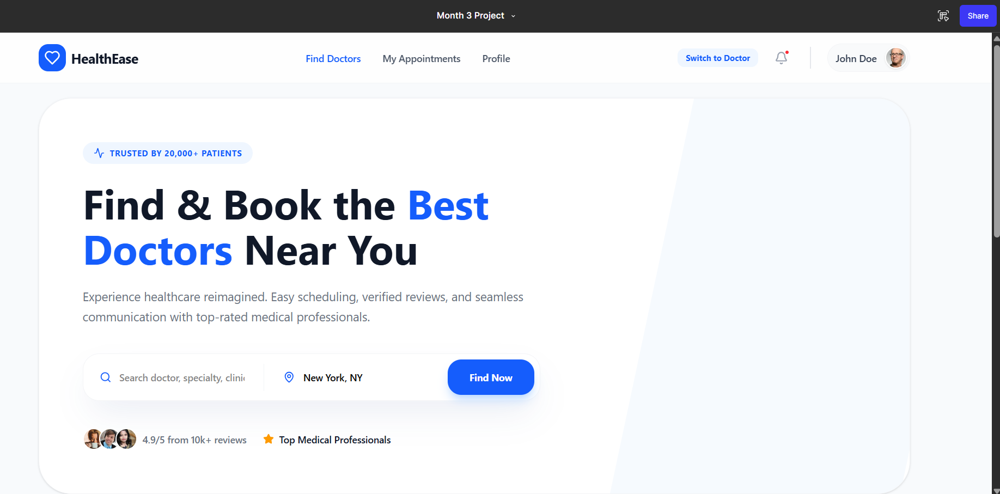
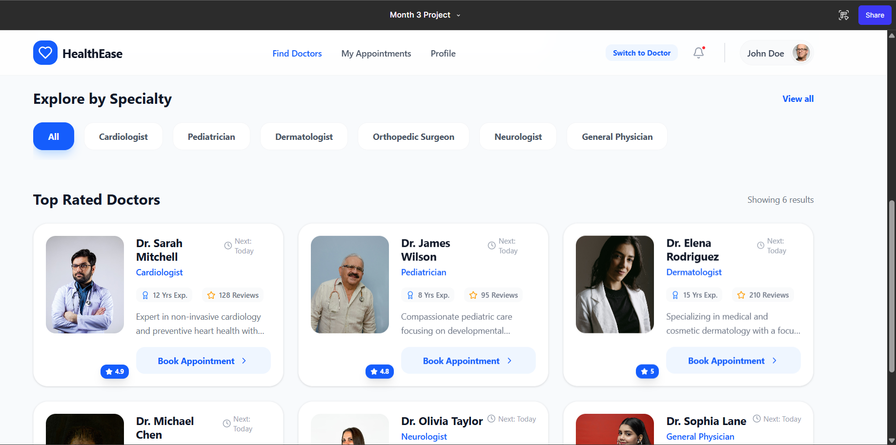
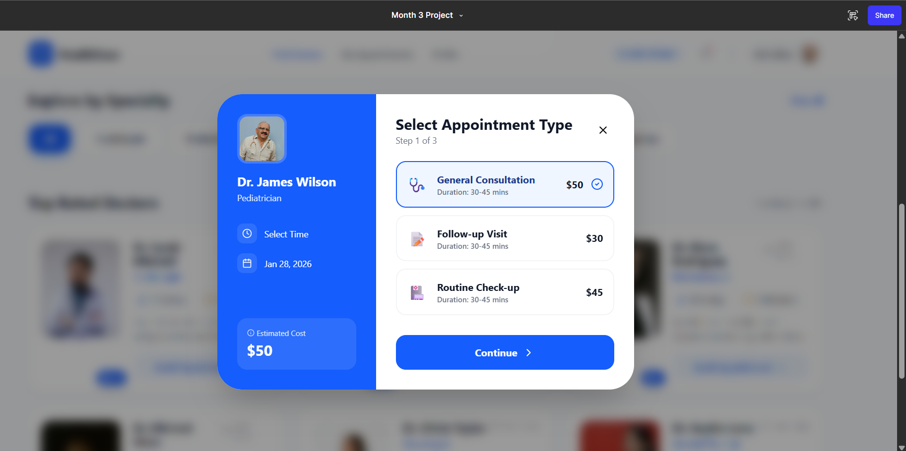
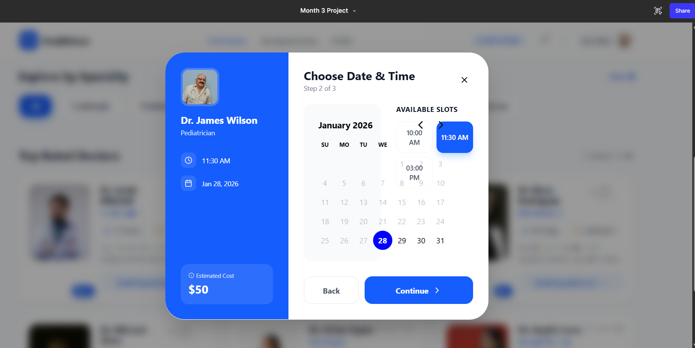
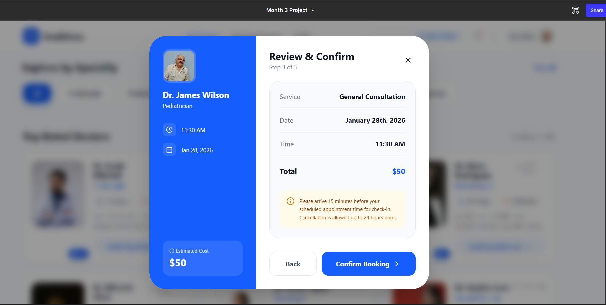
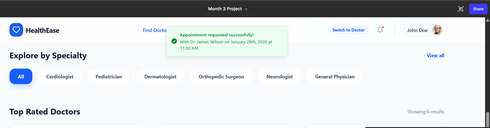

# Month 3 UI/UX Project — Healthcare Appointment System

Below are the six key screens designed for the Healthcare Appointment System.  
You can also interact with the full prototype here:  
👉 **[View Full Prototype on Figma](https://www.figma.com/make/1ysXe7qRy8ldqAwcIRLAUR/Month-3-Project?fullscreen=1)**

---

## Screenshots

### Page 1 — Landing Page

### Page 2 — Login / Signup

### Page 3 — User Dashboard

### Page 4 — Book Appointment

### Page 5 — Confirmation Screen

### Page 6 — Profile / Settings

---

## Highlights

- Intuitive appointment booking flow  
- Clean and accessible UI  
- Interactive prototype available online
